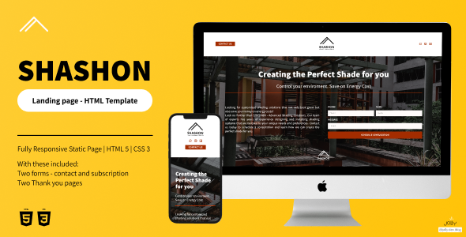

## Shashon - Advanced Shading Solutions Landing Page Template

Thank you for choosing the **Shashon - Advanced Shading Solutions landing page template**! 

This template is designed to help businesses in the shading solutions industry create a modern and professional-looking website that showcases their products and services.

## Preview

You can view a live preview of the template on our [GitHub Pages site](GitHublink). The live preview is a great way to get a feel for how the template looks and works.

## Getting Started

To get started with the template, simply download the files from ThemeForest and unzip them on your computer. You can then open the index.html file in your web browser to see the template in action.

## Customization
The template is fully customizable, allowing you to change the colors, fonts, images, and other elements to match your branding and style. The template includes well-organized CSS and HTML files, making it easy to modify the design and layout to fit your needs. For more information on customization, please refer to the included documentation in your downloaded file.

## Support
If you have any questions or issues with the template, please don't hesitate to contact us by [email](mailto:jolly.shop.blog@gmail.com). We're here to help and provide support to ensure that you have the best experience possible with our template.

Thank you again for choosing the **Shashon - Advanced Shading Solutions landing page template**! We hope it helps you create a stunning website for your business.